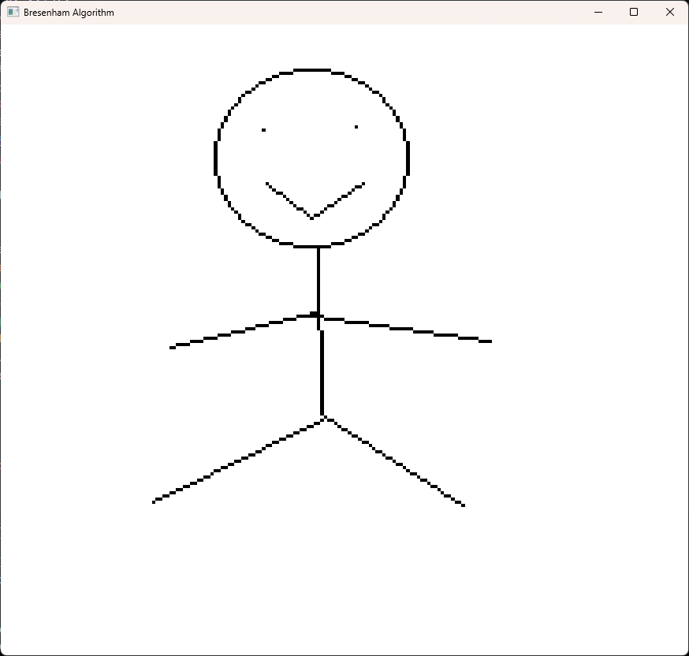

<h2>如何运行</h2>
确保ubuntu版本安装以下库
<code>
sudo apt update
sudo apt install mesa-utils build-essential libglfw3 libglfw3-dev libgl1-mesa-dev libglew-dev
</code>
把 <b>Experi</b> 里面相应实验的代码贴到main.cpp上，再在项目主文件夹终端输入<code>make run</code>即可
<h2>one.txt</h2> 
绘制直线和圆弧，窗口启动之后，可以按键盘上的l或者c来切换直线或者圆弧模式，按<code>ctrl+z</code>code>可以撤销上一次操作，按<code>ctrl+s</code>可以将图像保存到当前目录下。 
直线模式：鼠标左键设置起始点，此时直线另一端会随鼠标移动，再次按下左键完成直线的绘制。 
圆弧模式：鼠标左键设置圆心，再次按下左键固定半径，此时会以<b>顺时针角度</b>绘制圆弧，再次按下左键完成绘制。 
</img>
<h2>two.txt</h2>
